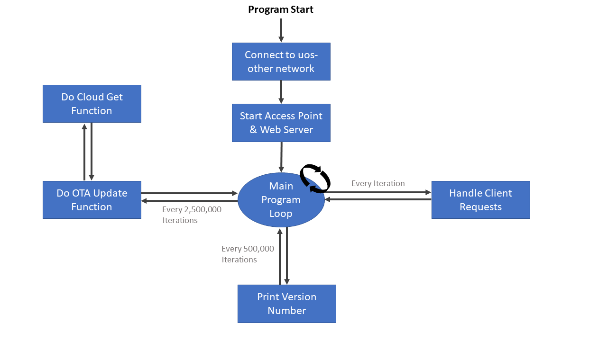

# OTA-Software-Update-ESP32-Csharp
Performing an 'OTA' (over-the-air) software update on an ESP32 chipset device.

Exercise 10: OTA update via GitHub
===

# Design

In order to perform an OTA update on the ESP32 we will first of all connect
to the uos-other network and access the "com3505.gate.ac.uk" web server. Once
a connection has been established we will attempt to perform an OTA update on the 
device. If an update is available the device will update, if not the main functionality 
of the device will be carried out.

To perform the OTA update itself we will do a HTTP get request to our binfiles directory 
on github to check the highest available version. If the highest available version exceeds
that of the current version we will continue with the update process. Following this, we will
check that the size of the updated bin file is atleast above 100k bytes so as to confirm the size
of the update is appropriate. If all is well we will then carry out the update process itself
and finally restart the device. If additional update files become available in the future we 
intend for the user to be able update the device by pressing the restart button on the device.

# Implementation

For the most part the implementation follows the processes as outlined in the design. There were
a couple of extra features we decided to add though. The first of which was a periodic check in the 
device loop that is performed using loop slices to check if there is a new update available. This 
functionality allows for devices to automatically update to the latest firmware as soon as it becomes
available. The clear advantage of this is that it eliminates the tedious process of clicking 'restart'
on all devices running the firmware to get the latest available update. Another additional piece of 
functionality we added includes firing up an access point and web server. This subsequently allows users
to join the access point of the device and configure which network they would like the device to join.

# Testing

Testing of the device consisted of the following tests:

1. Test to see if the device will update to the latest firmware if it is flashed an older version of the same
firmware. e.g. upload version 1 on the device and see if it will update to the latest version x (x>1) when it is started.

2. Make available a new version of the software and see if it will update to that version of the software when restart
is clicked manually on the device.

3. Make available a new version of the software and check whether the device will automatically update to that version
without any user interference.

4. Check that the user can connect to the device access point and that from there they can select any local network for the ESP32
to join and successfully join one of those and subsequently view the connection details.

# Functionality

In terms of the functionality of our solution, we have made it so that the device fires up a WIFI access point
and a web server. This allows a user to join the access point and then navigate to a web page which displays a list 
of scanned networks found. The user can then select one of these networks for the ESP32 device to join after entering 
the correct password for the chosen network.

Furthermore our device is set to periodically check for updates rather than be reset manually each time new firmware is 
available. The reason we chose to do this is due to the fact that if there are a large number of these devices that need updating, 
it is inefficient and time consuming to reset each one manually. Rather each device will check for updates and update itself 
automatically once it detects that new firmware is available.

# Security

When looking at how best to secure the device, we took into consideration methods to secure both the communications and the physical 
security of the device. In terms of the physical security of the device, there were several security concerns that should be addressed. 

Firstly someone with access to the physical device would be able to boot it into flash mode and serially push their own application onto the device. 
One method we found to rectify this issue is to enable secure boot in the ROM bootloader. This method ensures that only our code can run on the device 
by generating a key that is stored in the flash.

Another physical security risk that we found is that somebody could dump the contents of the flash memory and get access to the passkeys 
that are stored in plain text, such as the SSID and the passkeys. To avoid this from happening we could enable flash encryption 
from the bootloader. However once this is enabled the hardware only allows 3 subsequent flash updates via serial, the rest must be via 
OTA. As this device is not going into a production environment we felt that it wasn’t necessary to enable these physical security features.

In terms of securing the communications with the device we looked into using HTTPS with certificate pinning to make sure the device only downloads 
the firmware from a trusted server. Moreover using the MQTT messaging protocol would be an ideal way to secure communications on this device. 
This is due to the fact that the protocol is designed for constrained devices with low bandwidth such as our ESP32. 

